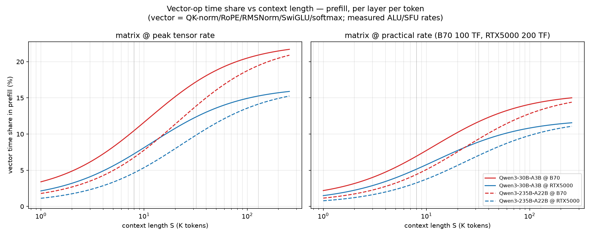

# Vector vs Matrix 算力比例研究:LLM 推理视角(B60 / B70 / RTX PRO 5000)

日期:2026-07-30。方法 = 公开资料调研 + 三台硬件实测验证。
测试源码:`src/bench_llm_vector.cpp`(SYCL/B70)、`src/bench_llm_vector.cu`(CUDA/RTX5000)、
`src/test_vec_rate_f16.cpp`;数据:`results/vector_llm_kernels.csv`、`results/vector_matrix_ratio.csv`。

## 1. LLM 推理中 vector 与 matrix 算子的分布(Qwen3 MoE 为例)

### 1.1 架构参数(官方 config.json)

| | Qwen3-30B-A3B | Qwen3-235B-A22B | Qwen3-Next-80B-A3B |
|---|---|---|---|
| hidden | 2048 | 4096 | 2048 |
| 层数 | 48(全 MoE) | 94(全 MoE) | 48(36 线性注意力 + 12 全注意力) |
| Attention | 32Q/4KV, d=128 | 64Q/4KV, d=128 | 16Q/2KV, d=256, RoPE 仅 25% 维度 |
| Experts | 128, top-8 | 128, top-8 | **512, top-10** + 1 shared |
| expert inter | **768** | 1536 | **512** |
| 其他 | RMSNorm + SwiGLU + QK-Norm,去 QKV bias | 同左 | 同左 |

来源:[Qwen3-30B-A3B config](https://huggingface.co/Qwen/Qwen3-30B-A3B/raw/main/config.json)、
[Qwen3-235B config](https://huggingface.co/Qwen/Qwen3-235B-A22B/raw/main/config.json)、
[Qwen3 技术报告 arXiv:2505.09388](https://arxiv.org/html/2505.09388v1)。

### 1.2 算子分类与精度

**Matrix 算子**(tensor core / XMX):QKV proj、O proj、lm_head、每个 expert 的
gate/up/down proj、router logits(小 GEMM)、attention 的 QK^T 与 PV。
精度:权重官方 bf16;官方 FP8 版(block 128 细粒度,激活 1×128 动态量化,
[Qwen3-235B-FP8](https://huggingface.co/Qwen/Qwen3-235B-A22B-FP8));NVFP4 版
**只量化 transformer block 内 linear 的权重和激活,norm/softmax 一律不量化**
([NVFP4 model card](https://modelscope.cn/models/nv-community/Qwen3-VL-235B-A22B-Instruct-NVFP4))。

**Vector 算子**(逐元素/归约,精度依 HF/vLLM 源码逐条核实):

| 算子 | 内部精度 | 说明 |
|---|---|---|
| RMSNorm / QK-Norm | **fp32** 归约,io bf16 | 输入先 `.to(fp32)`,variance fp32;vLLM kernel 同 |
| RoPE | **fp32** cos/sin | `autocast(enabled=False)` |
| attention softmax | **fp32** | HF eager 显式 fp32;FlashAttention 在线 softmax fp32 累加 |
| MoE router | softmax fp32 → top-k → 归一化 → bf16 | gating 加权/scatter 为 bf16 逐元素 |
| SiLU、residual、gating scale | bf16 | 逐元素 |
| FP8 路径 dequant/quant | 逐元素 cvt + scale | 每个 GEMM 前后一次 |
| KV cache 读写 | bf16/fp8 | 纯数据搬运 |

**规律:matrix 算子吃低精度红利(bf16→fp8→fp4),vector 算子被精度"钉死"在
fp32/bf16**——norm/softmax/RoPE 的 fp32 内部累加是正确性要求,不可量化。

### 1.3 decode 阶段:vector 占比被放大

- decode batch=1 时所有 linear 退化为 GEMV,**memory-bound**(临界 batch ≈ 算力/带宽,
  [kipply](https://kipp.ly/transformer-inference-arithmetic/));TPOT 由访存决定
  ([LIFE, arXiv:2508.00904](https://arxiv.org/html/2508.00904v1))。
- 公开 profiling(GPT-2/OPT, [HAAN arXiv:2502.11832](https://arxiv.org/pdf/2502.11832v1)):
  LayerNorm 原生占运行时 16%;当 GEMM 上 FP8、attention 上 FlashAttention 后,
  **norm 占比升到 >33%**——vector 算子占比与"matrix 被优化到什么程度"正相关。
- **MoE 特有**:tensor core 利用率 ≈ topk/num_experts([MegaScale-Infer,
  arXiv:2504.02263](https://arxiv.org/html/2504.02263v1))。Qwen3-235B = 8/128 =
  6.25%,Qwen3-Next = 10/512 ≈ 2%——**expert GEMM 很难打满张量核**,且 Qwen3 的
  per-expert GEMM 形状特别小(768/512),叠加 router/gather/scatter 等额外
  vector/通信开销。matrix 峰值在 MoE decode 下基本是纸面数字。

## 2. 三款硬件的 vector:matrix 算力比(实测)

### 2.1 实测数据(锁频,取峰值)

| | B60 (160EU) | B70 (256EU) | RTX PRO 5000 (110SM) |
|---|---|---|---|
| vector fp32 FMA | 12.3 TF(推算) | **19.66 TF**(16.0 lane-op/cyc/EU) | **65.7 TF**(116 FMA/clk/SM) |
| vector fp16 FMA | — | ~19-20 TF(**与 f32 同速,非 2×**) | 71.7 TF(HFMA2,同 lane 率) |
| vector bf16 FMA | — | **3.73 TF(1/4 速率,软件模拟!)** | — |
| 超越函数 exp/rsqrt | — | 1.84 TOPS(3.0 lane-op/cyc,1:5.3) | 4.53 TOPS(MUFU 16/clk,1:7.3) |
| matrix bf16 | 97.66 TF(XMX) | **157.2 TF**(XMX) | **289.4 TF**(mma 实测) |
| matrix int8/fp8 | — | 314.4 TOPS(int8) | 578.2 TF(fp8) |
| matrix fp4 | 不支持 | 不支持 | 577.2 TF |
| **ratio fp32 : bf16 matrix** | **1 : 7.9** | **1 : 8.0** | **1 : 4.4** |
| ratio fp32 : fp8/int8 | — | 1 : 16 | 1 : 8.8 |
| DRAM 带宽(triad 实测) | — | 497 GB/s | 1116 GB/s(理论 1344) |

### 2.2 关键发现

1. **B70 的 vector:matrix 差距(1:8)约为 RTX5000(1:4.4)的 2 倍**;数据中心卡
   更极端(H100 1:14.8,B200 1:30,来源见 §3.4)——全行业 tensor 增速 > vector,
   但 Intel 工作站卡的配比已偏斜于 NVIDIA 同级产品。
2. **B70 的 bf16 向量 FMA 是软件模拟,只有 f32 的 1/4**(3.73 TF):Xe2 EU 没有
   bf16 向量 FMA 指令,IGC 展开为 cvt→f32 fma→cvt 序列。LLM 的 io 精度是 bf16,
   若 kernel 直接用 bf16 做向量数学会掉到这个慢速路径(生产 kernel 都转 fp32 算,
   代价是额外的 cvt 指令)。
3. 两家的 f16 向量都**不是** f32 的 2 倍(与直觉相反,实测为准)。
4. 超越函数相对速率:B70 EM 1:5.3 vs NVIDIA MUFU 1:7.3,Intel 反而略好;
   绝对值 NVIDIA 2.5 倍(4.53 vs 1.84 TOPS)。

## 3. vector 计算成为瓶颈时,NVIDIA 的对策(调研)

### 3.1 没有专用 norm/softmax 硬件单元

NVIDIA 的路线是 **"tensor core 做 GEMM + CUDA core/MUFU 做 vector + 软件融合"**:

- **cuBLASLt fused epilogue**:GEMM 累加器写回前融合 bias/GELU 等逐元素操作,
  消掉一次显存往返([nvmath Epilogue 文档](https://docs.nvidia.com/cuda/nvmath-python/latest/bindings/generated/nvmath.bindings.cublasLt.Epilogue.html))。
- **cuDNN fused attention / FlashAttention**:softmax 与两次 GEMM 软件融合单 kernel。
- **MUFU 的局限与软件绕过**:MUFU(exp/rcp/rsqrt)= 16 ops/clk/SM,Hopper→Blackwell
  **原地踏步**;FlashAttention-4 因 MUFU 太慢,**改用 FMA 多项式软件模拟 exp2**
  ([Tri Dao 博客](https://tridao.me/blog/2026/flash4/)、[FA4 论文](https://arxiv.org/html/2603.05451v1)),并靠异步流水让 softmax 与 MMA 重叠,B200 利用率推到 71%。
- **tensor memory(tmem)**:Blackwell SM 内 256KB 专用存储,为 tensor 流水设计,
  FA4 顺手用它暂存 softmax 中间态([Colfax tmem 教程](https://research.colfax-intl.com/cutlass-tutorial-writing-gemm-kernels-using-tensor-memory-for-nvidia-blackwell-gpus/))。
- **CUDA core 侧的历代改进**:Ampere 消费级 FP32 双倍化(128 FMA/SM/clk);
  Blackwell **统一 INT32/FP32 核心**,整数吞吐翻倍(地址计算受益)
  ([FixStars 对比](https://blog.us.fixstars.com/what-kind-of-gpu-is-the-nvidia-rtx-pro-6000-blackwell-max-q/))。
- **硬件 cvt 指令**:fp8↔fp16 有原生 `cvt` 指令(`__nv_cvt_fp8x2_to_halfraw2`),
  本测试 §4 专门验证了其价值。

### 3.2 "vector 成为瓶颈"的公开讨论

- FA4 提出 **"asymmetric hardware scaling"**:tensor core 每代翻倍,MUFU/shared
  memory 带宽不变,softmax 从配角变成与 matmul 耗时相当的瓶颈
  ([Swarm Signal 解读](https://swarmsignal.net/flashattention-4-asymmetric-scaling/)、
  [Hao AI Lab "Bloated Tensor Cores and the Softmax Bottleneck"](https://haoailab.com/blogs/attn-qat/))。
- B200 的 vector:matrix = 1:30(FP32 75 TF vs BF16 2250 TF,
  [NVIDIA HGX B200 官方页](https://www.nvidia.com/en-us/data-center/b200/))。

## 4. 硬件验证:LLM 典型 vector kernel 实测

相同形状(hidden 2048、vocab 151936,对齐 Qwen3)的 5 类 kernel 在两平台实测
(B70 锁频 2.4GHz,RTX5000 GPU0,取 20 次最优):

| kernel | B70 GB/s(%triad) | RTX5000 GB/s(%triad) | 结论 |
|---|---|---|---|
| triad bf16(带宽基线) | 497(100%) | 1116(100%) | — |
| RMSNorm bf16 N=2048 | 453(91%) | 1006(90%) | 带宽 bound |
| SwiGLU silu×mul | 486(98%) | 853(76%) | 带宽 bound;RTX5000 略受 exp 影响 |
| softmax fp32 vocab | 803*(L2 加速) | 1458*(L2 加速) | 带宽 bound |
| dequant fp8→bf16 **软件移位** | **437(88%)** | 1087(97%) | **B70 唯一低于基线的 kernel** |
| dequant fp8→bf16 **硬件 cvt** | (无此指令) | 1066(96%) | NVIDIA 软硬两条路都打满 |

**验证结论**:

1. **norm/activation/softmax 这类 vector 算子,在两平台上都是带宽 bound,不是
   ALU bound**——"vector 瓶颈"在单 kernel 层面本质是**显存带宽瓶颈**,
   软件融合(减少显存往返)比堆 vector ALU 更有效,这解释了 NVIDIA 为什么不
   做专用 norm 硬件。
2. **唯一的例外是 dequant**:B70 没有 fp8 硬件 cvt(第 10 章已证:~8 条 ALU/元素),
   实测软件路径比带宽基线低 12%(437/497);RTX5000 上软/硬两条路径都 ~97%
   (它的 ALU:BW 配比更厚,且还有硬件指令兜底)。FP8 模型权重是显存里的主流
   格式,这个缺口会随 FP8 普及放大。
3. RTX5000 的绝对带宽是 B70 的 2.2 倍(1116 vs 497 GB/s)——decode 整体带宽
   bound 的场景下,这比任何算力差异都更致命。

## 5. 对 B70 硬件设计的 insights

按收益排序:

1. **加 fp8↔bf16/f16 硬件 cvt 指令(向量路径)**。已证 B70 上 dequant 需要
   ~8 条 ALU/元素且是唯一掉下带宽基线的 vector kernel;Xe3 已把 FP8 cvt 加入
   ISA,应尽快下放到独显产品线。成本低(一个小功能单元),直接消除 W8A16
   推理的固定开销。
2. **原生 bf16 向量 FMA(或至少高速 cvt)**。实测 bf16 向量 FMA 只有 f32 的
   1/4(3.73 TF,软件模拟)。LLM 生态的 io 精度是 bf16,即使内部 fp32 计算,
   每次进出都要付 cvt 代价。
3. **优先提显存带宽,而不是继续堆 XMX**。B70 的 vector:matrix 已 1:8
   (RTX5000 1:4.4),而实测所有 LLM vector kernel 都是带宽 bound;decode 的
   TPOT 由带宽决定。157 TF 的 XMX 在 MoE decode(topk/experts = 2-6%)下利用率
   本就极低——**均衡设计比峰值算力重要**。
4. **硬件 sigmoid/tanh + 更快 EM**。SwiGLU 靠 exp,softmax 全靠 exp;B70 实测
   EM 3.0 lane-op/cyc(EU 的 1/5.3)。Xe3 已有硬件 sigmoid/tanh,方向正确;
   NVIDIA FA4 的教训是 MUFU 停滞会让 softmax 反客为主——Intel 有机会在 Xe3
   一代直接反超。
5. **XMX 对 GEMV/小 M 的友好化**。MoE decode 每 expert token 数少,dpas 8×8
   tile 在 M=1 时浪费 87.5% 计算。支持 M=1 的 dpas 变体、或强化 SIMT GEMV
   路径(现在的 XMX 峰值在 decode 场景是纸面数字)。
6. **XMX 流水的 fused epilogue 硬件钩子**。对标 cuBLASLt epilogue:GEMM 累加
   结果在写回显存前直接过一道 vector 操作(bias/activation/dequant-scale),
   省一次显存往返——这对带宽受限的 B70 收益比 NVIDIA 更大。

## 6. 追问:vector 会成为推理瓶颈吗?需要堆 vector 单元吗?

**答案:不需要堆 vector 计算单元——B70 的 1:8 在 LLM 负载下是宽裕的;
vector 瓶颈是结构性问题(带宽、转换、超越函数),不是规模问题。**

分四层论证:

1. **单 kernel 层面:不会(实测已否定)**。五类 LLM vector kernel 在 B70 和
   RTX5000 上全部跑到带宽基线的 88–98%——卡在显存带宽,不卡在 ALU。
   给这些 kernel 加 vector 单元,吞吐不会动。
2. **decode 系统层面:不会**。decode 每 token 读全部权重,TPOT 由访存决定;
   B70 带宽(497 GB/s)与 RTX5000(1116 GB/s)的 2.2 倍差距,影响远大于任何
   算力差异。且 MoE tensor 利用率 ≈ topk/experts(2–6%),XMX 峰值在 decode
   下大面积闲置——matrix 都算不满,vector 更不缺。
3. **vector 真能成为瓶颈的条件:算力比极端 + 长上下文 prefill**。以
   Qwen3-30B 一层估算:matrix ≈ 125 MFLOP/token,vector ≈ 0.2 MFLOP
   (占 ~0.15%)。耗时占比 = flops 占比 × 算力比:B70(1:8)≈ 1.2%(不是
   瓶颈);B200(1:30)≈ 4.5%,长上下文 softmax exp 再放大数倍——这正是
   FlashAttention-4 在 Blackwell 上 "softmax 与 matmul 耗时相当" 的来源。
   且矛盾集中在两个特定功能:**超越函数 exp**(B70 EM = fma 的 1/5.3;
   NVIDIA MUFU 两代未涨,FA4 用 FMA 多项式绕开)与**精度转换 cvt**
   (B70 bf16 向量 FMA 仅 1/4 速率、fp8 dequant ~8 ALU/元素)。
4. **设计判据**:vector 峰值只需 ≥ matrix 峰值 × vector flops 占比
   (≈ 1–5%),即 **1:20~1:100 就足够**(可流水掩盖前提)。B200 的 1:30
   已踩线,B70 的 1:8 有富余。

**对 B70 的结论**:不堆 vector 单元;优先级是 带宽 > fp8/bf16 硬件 cvt >
硬件 sigmoid/tanh/exp 快速通道 > 原生 bf16 向量 FMA(见 §5)。

## 7. Attention 中 vector fp32 的定量分析:prefill 长上下文 vs decode(2026-07-30)

以 Qwen3-30B-A3B(32Q/4KV heads,d=128,hidden=2048,top-8 experts inter 768)
每层每 token 建模。B70 实测速率:fp32 普通 op 9.83 Tops/s、exp(EM) 1.84 Tops/s、
XMX bf16 157 TF(峰值)/ ~100 TF(实际 FA 估)。

算量:matrix 固定项 114 MF(QKV+O+MoE+router)+ 注意力 8192·S FLOP;
vector 固定项 0.12 MF(QK-Norm+RoPE+2×RMSNorm+SwiGLU)+ softmax 80·S ops
(含 16·S exp;decode 翻倍为 160S/32S)。

### Prefill(B70,vector 时间 vs matrix 时间)

| S | matrix | matrix @157TF(@100TF) | vector(非exp+exp) | 占比 |
|---|---|---|---|---|
| 8K | 181 MF | 1.2(1.8) µs | 0.14 µs | 8-12% |
| 32K | 382 MF | 2.4(3.8) µs | 0.51 µs | 13-21% |
| 128K | 1188 MF | 7.6(11.9) µs | 2.0 µs(exp 单项 1.14) | 17-26% |

- 渐近(S→∞)只看注意力项:vector/注意力 matrix ≈ **32%**,不会反超
  (softmax 80S ops vs GEMM 8192S FLOP,flops 差 100× 而算力比仅 8-16×)。
- **结论:不是瓶颈,但不可忽略**。FA 式融合(softmax 与 dpas 重叠)可基本
  藏掉;softmax 独立 kernel 的 naive 实现则净亏 20%+,还要付 scores 矩阵的
  显存往返(S=128K 时 32×128K×4B = 16MB/token)。
- vector 内部大头是 **exp 单项**(S=128K 时占 matrix 15%)——与 FA4 在
  B200 上的观察同构:矛盾在超越函数吞吐,不是通用 FMA。

### Decode(KV cache,B70)

每层每 token:权重 125MB + KV 2048·S 字节;S=32K 时访存 192MB → 386 µs。
vector 合计 1.1 µs → **占比 ≈ 0.3%,完全不是瓶颈**(注意力 GEMV 本身也仅
0.9%)。decode 一切由带宽决定。

### B200 的教训:细节、Rubin 是否改进、软件补救

- H100→B200:BF16 dense 989.5→2250 TF(2.27×),FP32 67→75(1.12×),
  MUFU 与 SMEM 带宽原地踏步,比例 14.8→30。FA3 时代 softmax 占 attention
  ~25-30%;照搬 B200 会追平 MMA 时间,利用率掉到 ~50%。
- FA4 的软件补救([arXiv:2603.05451](https://arxiv.org/html/2603.05451v1)、
  [tridao.me](https://tridao.me/blog/2026/flash4/)):①软件 exp(FMA 多项式
  代替 MUFU)②softmax(CUDA core)与 UMMA(tensor core)全异步重叠
  ③tmem 暂存中间态 → B200 1613 TF = 71% dense peak。
- **Rubin R100(2026)没有回补 vector**:P100→R100 十年 tensor 涨 2380×、
  FP32 仅 10×([GPU 架构十年演化](https://research.frankk.site/gpu-architecture-evolution/));
  Rubin 继续堆 FP4(35-50 PF)与 HBM4(~20 TB/s)([2CRSi](https://2crsi.com/nvidia-vera-rubin-generation-cpu-gpu))。
  NVIDIA 路线:vector 缺口靠带宽+软件融合补,不靠硬件回补。
- 软件补救清单:①融合 SDPA(消显存往返)②软件 exp 多项式 ③用 tensor
  core 做归约(row-sum/max 写成与全 1 向量的 GEMV,XMX 同样成立)
  ④模型架构层(MLA 压 KV;Qwen3-Next 36/48 层线性注意力,75% 的层无
  softmax)⑤编译器融合。
- **对 B70 的启示**:1:8 + EM 1:5.3 比 B200 健康,风险不在硬件配比而在
  软件栈——没有 FA 式融合 kernel 时,20% vector 开销和 scores 显存往返会
  原样暴露。这比任何硬件改动都优先。

## 8. Vector 占比 vs 上下文长度曲线:30B/235B × B70/RTX5000(2026-07-31)

把 §7 的单点估算扩展成 S = 1K→256K 的连续曲线,并加入第二个模型
Qwen3-235B-A22B(hidden 4096,64Q/4KV heads,inter 1536:matrix 固定项 446 MF +
注意力 16384·S FLOP;vector 固定项 0.23 MF + softmax 160·S ops 含 32·S exp)
和第二个平台 RTX PRO 5000(fp32 普通 op ~32.9 Tops/s、MUFU exp 4.34 Tops/s、
tensor bf16 289 TF 峰值 / ~200 TF 实际)。脚本 `src/plot_vector_share.py`,
数据 `results/vector_share_vs_S.csv`。



关键读数(vector 时间 / (vector+matrix) 时间,prefill 每层每 token):

| 模型 @ 平台 | matrix 速率 | S=1K | S=8K | S=32K | S=128K | S=256K |
|---|---|---|---|---|---|---|
| 30B @ B70 | 峰值 157 TF | 3.4% | 10.7% | 17.5% | 20.9% | 21.7% |
| 30B @ B70 | 实际 100 TF | 2.2% | 7.1% | 11.9% | 14.4% | 15.0% |
| 30B @ RTX5000 | 峰值 289 TF | 2.2% | 7.4% | 12.6% | 15.3% | 15.9% |
| 30B @ RTX5000 | 实际 200 TF | 1.5% | 5.2% | 9.0% | 11.1% | 11.6% |
| 235B @ B70 | 峰值 157 TF | 1.8% | 6.9% | 14.2% | 19.4% | 20.9% |
| 235B @ B70 | 实际 100 TF | 1.2% | 4.5% | 9.5% | 13.3% | 14.4% |
| 235B @ RTX5000 | 峰值 289 TF | 1.1% | 4.7% | 10.1% | 14.1% | 15.3% |
| 235B @ RTX5000 | 实际 200 TF | 0.8% | 3.3% | 7.2% | 10.2% | 11.1% |

结论:

- **S ≤ 8K 时 vector 占比 < 11%**,融合 kernel 一盖就没;真正的暴露区在
  S ≥ 32K 的长上下文 prefill。
- **B70 的 vector 占比系统性高于 RTX5000 约 3-5 个百分点**(同模型同 S),
  差距来源不是 FMA 比值(1:8 vs 1:4.4 中 B70 反而更健康),而是
  **EM/exp 吞吐**:B70 exp 1.84 Tops/s 仅为普通 op 的 1/5.3,RTX5000 MUFU
  4.34 为 1/7.6——但 B70 的 XMX:EM 比值 157:1.84 = 85 倍于 RTX5000 的
  289:4.34 = 67,softmax 重的 workload 在 B70 上相对更吃亏。
- 曲线在 S ≈ 128K 后趋于平缓(渐近值由 softmax ops : 注意力 FLOP 的固定
  系数决定),**不会随 S 继续恶化**——vector 永远不会反超 matrix,但
  20% 量级的固定税需要 FA 式融合来消除。
- 235B 的固定 matrix 项更大(MoE 302 MF),同样 S 下占比低于 30B;
  即**模型越大,MoE GEMM 越摊薄 vector**,瓶颈更偏向带宽而非算子配比。

## 附:复现

```bash
# B70 (锁频 2.4GHz)
icpx -fsycl -fsycl-targets=intel_gpu_bmg_g31 -O3 -o bench_llm_vector src/bench_llm_vector.cpp
icpx -fsycl -fsycl-targets=intel_gpu_bmg_g31 -O3 -o test_vec_rate_f16 src/test_vec_rate_f16.cpp
# RTX PRO 5000 (CUDA 13, sm_120a)
nvcc -O3 -gencode arch=compute_120a,code=sm_120a src/bench_llm_vector.cu -o bench_llm_vector
# §8 曲线(纯解析,无需 GPU)
python3 src/plot_vector_share.py   # → report/vector_share_vs_S.png + results/vector_share_vs_S.csv
```

注意:B70 f16 速率测试的 DCE 陷阱——guard 值若取 half 不可精确表示的常数
(如 12345.678f),IGC 会证明 guard 永假并把整个 kernel 删掉(实测 f16 循环
被完全消除,得到 10^15 量级的假数字);bf16 向量 FMA 的 1/4 速率是 IGC 展开
为 f32 序列所致,非原生指令。
